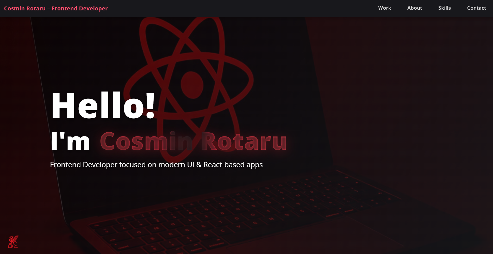

# Cosmin Rotaru — Portfolio

This is my personal portfolio as a frontend developer. Here you can find my main projects, skills, and contact information.

## Technologies Used

- React
- Tailwind CSS
- JavaScript (ES6+)
- Vite

## Live Demo

[Check out the live portfolio here](https://rotarucosmin-portfolio.netlify.app/)

## Preview



## Features

- Modern UI and responsive design
- Project showcase with links to live demos and GitHub repositories
- Skills section
- Contact information with social links

## Contact

- [LinkedIn](https://www.linkedin.com/in/marius-cosmin-rotaru-a8a242262/)
- [GitHub](https://github.com/CosminMRotaru)
- Email: cosminmariusrotaru@gmail.com

## How to Run Locally

1. Clone the repository:
    ```bash
    git clone https://github.com/CosminMRotaru/P2.git
    ```
2. Navigate to the project directory:
    ```bash
    cd P2
    ```
3. Install dependencies:
    ```bash
    npm install
    ```
4. Start the development server:
    ```bash
    npm run dev
    ```
5. Open [http://localhost:5173](http://localhost:5173) in your browser to view the site.

## License

This project is licensed under the MIT License.
